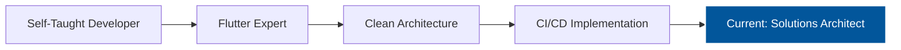

<div align="center">
  
# 🚀 Abhishek R | Flutter Developer

[](https://git.io/typing-svg)

[](your-linkedin-url)
[](your-github-url)
[](mailto:your.email@gmail.com)

</div>

<div align="center">
  
</div>

## 💫 About Me

🎯 Passionate Flutter Developer crafting pixel-perfect, high-performance mobile experiences  
🔭 Specialized in building scalable applications with clean architecture  
🌟 Strong advocate of CI/CD and automated testing  
💡 Love sharing knowledge through open-source contributions  
🤝 Always eager to collaborate and help fellow developers  
📱 Experience with both Android and iOS platforms  

## 🛠️ Technology Arsenal

<div align="center">

    

</div>

```dart
class FlutterDeveloper {
  final String name = "Abhishek R";
  final List<String> expertise = [
    "Clean Architecture",
    "State Management (GetX, Provider, Bloc)",
    "CI/CD Pipeline Implementation",
    "Firebase Integration",
    "Custom Animations",
    "Performance Optimization"
  ];
  
  List<String> getCurrentProjects() => [
    "🎸 Rhuon - Band Booking Platform",
    "⏰ Tickyfy - Habit Tracker",
    "📱 Open Source Flutter Packages"
  ];
}
```

## 🎯 Featured Projects

### 🎸 Phuong - Band Booking Platform
<div align="center">
  
</div>

A revolutionary platform bridging local musicians with event organizers 🌟

**Tech Highlights:**
- 🏗️ Clean Architecture with GetX state management
- 🔥 Firebase integration for real-time features
- 💳 Secure payment gateway integration
- 📱 Cross-platform support (iOS & Android)
- 🚀 CI/CD pipeline with GitHub Actions

### ⏰ Tickyfy - Habit Tracker
<div align="center">
  
</div>

Minimalist habit tracking app with powerful features 🎯

**Key Features:**
- 🎨 Modern, minimalist UI/UX
- 🗄️ Offline-first architecture with Hive
- 🔊 Voice input capabilities
- 📊 Rich analytics and progress tracking


## 🎓 Continuous Learning

- 📚 Currently exploring advanced animation techniques in Flutter
- 🔍 Researching best practices for scalable app architecture
- 💡 Experimenting with new state management solutions
- 🌐 Contributing to open-source Flutter projects

## 💼 Professional Journey



## 📫 Let's Connect!

<div align="center">
  
💬 Open for collaborations and exciting Flutter projects!  
📧 Reach out for Flutter development discussions or help
  


</div>

---

<div align="center">
  
</div>
